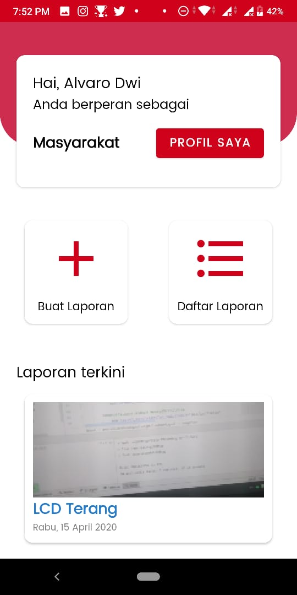
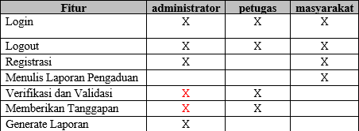
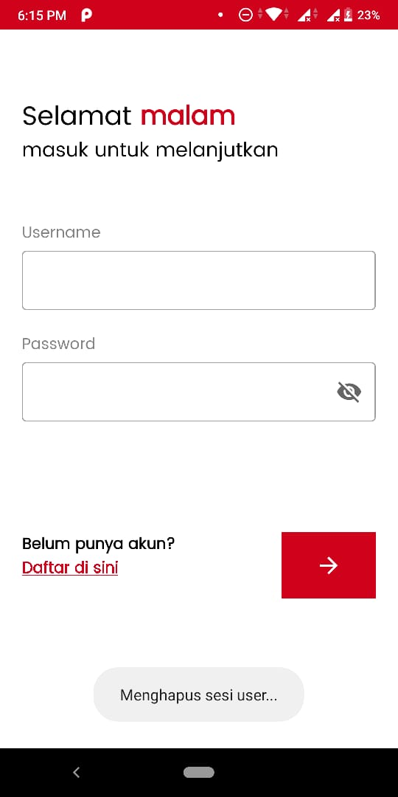
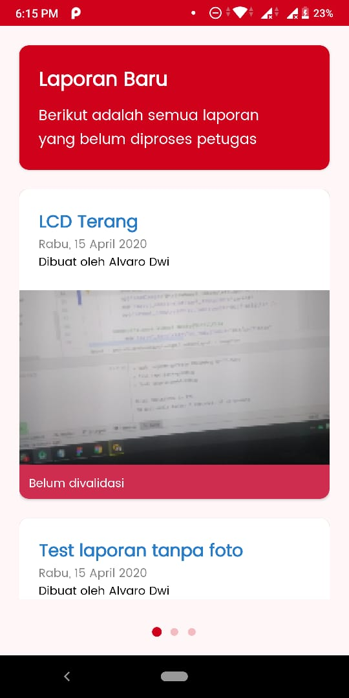
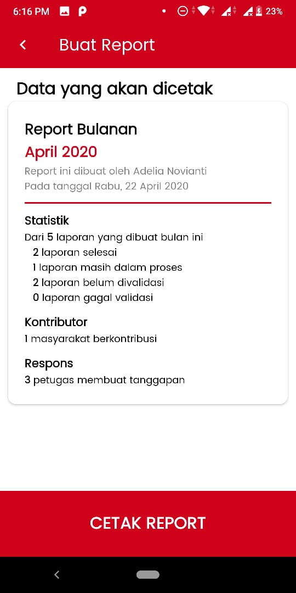

<!--
 Using https://github.com/othneildrew/Best-README-Template for this README~
 Hopefully it's readable
 It's in indonesian too!
>

<!--
*** Thanks for checking out this README Template. If you have a suggestion that would
*** make this better, please fork the repo and create a pull request or simply open
*** an issue with the tag "enhancement".
*** Thanks again! Now go create something AMAZING! :D
***
***
***
*** To avoid retyping too much info. Do a search and replace for the following:
*** github_username, repo, twitter_handle, email
-->

<!-- PROJECT SHIELDS -->
<!--
*** I'm using markdown "reference style" links for readability.
*** Reference links are enclosed in brackets [ ] instead of parentheses ( ).
*** See the bottom of this document for the declaration of the reference variables
*** for contributors-url, forks-url, etc. This is an optional, concise syntax you may use.
*** https://www.markdownguide.org/basic-syntax/#reference-style-links
-->
[![LinkedIn][linkedin-shield]][linkedin-url]

<!-- PROJECT LOGO -->
 

    

  <h3 align="center">LaporKan</h3>

  

    Aplikasi Pengaduan Masyarakat Berbasis Android
  

<!-- TABLE OF CONTENTS -->
## Daftar Isi

- [Daftar Isi](#daftar-isi)
- [Tentang Projek Ini](#tentang-projek-ini)
  - [Library yang Digunakan](#library-yang-digunakan)
- [Panduan Memulai](#panduan-memulai)
  - [Metode Testing Optimal](#metode-testing-optimal)
  - [Testing Tips](#testing-tips)
- [Screenshots](#screenshots)
- [Pengembangan Selanjutnya](#pengembangan-selanjutnya)

<!-- ABOUT THE PROJECT -->
## Tentang Projek Ini

LaporKan adalah aplikasi pengaduan masyarakat berbasis Android, dibuat dalam rangka latihan selama masa pandemi covid-19 dan penyelesaian tugas akhir PWPB SMKN 4 Bandung tahun 2020.

LaporKan menggunakan bahasa Kotlin dan [Jetpack Component](https://developer.android.com/jetpack) sebagai fondasi projeknya.

Hierarki pembagian fitur aplikasi berdasarkan level user :

### Library yang Digunakan

LaporKan tidak akan terwujud tanpa library-library berikut :
* [ThreenTenABP](https://github.com/JakeWharton/ThreeTenABP)
* [MonthYearPicker](https://github.com/dewinjm/monthyear-picker)
* [iTextPDF](https://github.com/itext/itextpdf)
* [Stetho](https://facebook.github.io/stetho/)

<!-- GETTING STARTED -->
## Panduan Memulai

Projek ini menggunakan gradle. Untuk membuka proyek ini, gunakan
`gradlew build` command atau gunakan "Import Project" di Android Studio.

### Metode Testing Optimal

Tahap-tahap yang perlu dilakukan untuk melakukan testing :
* Buat akun masyarakat baru, jika sudah, login dengan akun masyarakat tersebut
* Buat laporan baru dari beranda masyarakat
* Jika sudah, logout dan login dengan akun petugas, gunakan akun petugas default yang ada diatas
* Buka laporan yang Anda buat tadi, validasi dan berikan tanggapan.
* Setelah tahap ini, Anda sudah testing fitur masyarakat dan petugas
* Untuk fitur report Admin, login sebagai Admin, dan pilih menu buat report->report bulan ini->cetak report
* DONE! Semua fitur sudah di test!!

### Testing Tips

Beberapa tips untuk melakukan testing dalam aplikasi ini :

* Kode Admin default adalah `SMKB1S4!`, gunakan kode admin ini untuk registrasi sebagai Admin untuk testing fitur cetak laporan
* Akun default admin dapat dipakai, gunakan username `root` dan password `admin` untuk menggunakan akun tersebut
* Akun default petugas dapat dipakai, gunakan username `root` dan password `petugas` untuk menggunakan akun tersebut
* Atau lebih baik, coba buka [PetugasJSON](https://github.com/alvarodwi/LaporKan/blob/master/app/src/main/resources/PetugasJSON.json) dan edit sendiri akun default untuk petugas.

Beberapa hal yang harus dicatat :
* Fitur report tidak akan menampilkan data sebelum ada laporan di bulan tersebut
* Terkadang, ada bug pada splash screen dimana splash screennya akan stuck. Swipe-to-destroy cukup untuk bugfix
* Tombol logout ada di profil yang bisa diakses dari beranda

<!-- USAGE EXAMPLES -->
## Screenshots

## Pengembangan Selanjutnya

Ada beberapa hal yang belum terwujud dari LaporKan ini, yang paling fatal itu adalah ketiadaan cloud database. LaporKan hanya menggunakan database lokal seperti SQLite sehingga tidak ada interaksi nyata antar user lintas perangkat. 

Integrasi dengan firebase sudah dicanangkan apabila projek ini dilanjutkan, tapi mengingat dengan bentukannya seperti ini pun sudah memenuhi tugas akhir PWPB maka rencana firebase ini akan ditunda hingga waktu yang belum ditentukan.

<!-- MARKDOWN LINKS & IMAGES -->
<!-- https://www.markdownguide.org/basic-syntax/#reference-style-links -->
[linkedin-shield]: https://img.shields.io/badge/-LinkedIn-black.svg?style=flat-square&logo=linkedin&colorB=555
[linkedin-url]: https://linkedin.com/in/alvarodwi